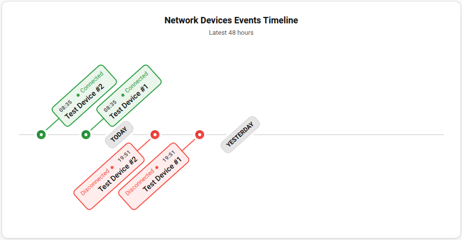
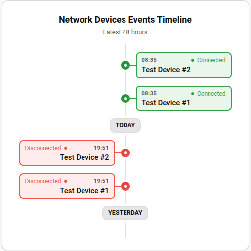

# Device Pulse Timeline Card

## Introduction

The **Device Pulse Timeline Card** is a custom Lovelace card designed to work with the [Device Pulse](https://github.com/studiobts/home-assistant-device-pulse) integration.
It provides a clear, visual timeline of connection and disconnection events for each monitored device, offering both **horizontal** and **vertical** layouts to fit any dashboard design.

---

## Features

- Visual history of online and offline events per device
- Horizontal or vertical orientation
- Adjustable timeline range
- Realtime Updates

<p float="left">
  
  
</p>

## Configuration via Editor

All configuration for the **Device Pulse Timeline Card** can be done directly through the **Lovelace visual editor**.  
No manual YAML editing is required.  

---

## Installation

### HACS (Recommended)

1. Add the custom repository `REPO` to HACS.
2. Search for **Device Pulse Timeline Card** and install it.
3. Add the card to your Lovelace dashboard.

### Manual Installation

1. Download the latest release from `REPO/releases`.
2. Copy the `device-pulse-timeline.js` and `device-pulse-timeline.css` file to `www/device-pulse-timeline` folder.
3. Add the following resource in your Lovelace configuration:

```yaml
url: /local/device-pulse-timeline.js
type: module
```

## Usage Notes

- The card requires active Device Pulse integration.
- The card supports automatic updates through the Home Assistant WebSocket connection.

